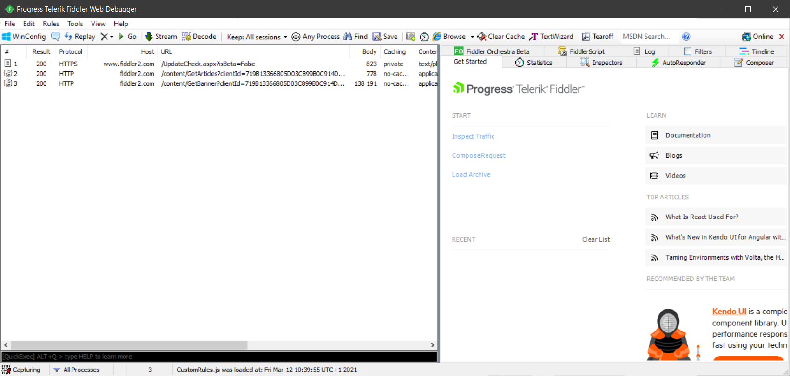

# Groove Coaster 2 iOS/Android : Guide pour obtenir toutes les chansons sans jailbeak/root

Voici un petit guide sympa expliquant comment obtenir **toutes** les chansons du jeu,
sans devoir dépenser des tonnes de thunes ou avoir recourt au jailbreak ou au rootage de l'appareil.

 > **Note** : Des compétences en informatique, disons avancés, sont nécessaires pour mener à bien ces manipulations.
 > Ce guide utilise un exécutable qui met en pratique une attaque [**MTIM**](https://fr.wikipedia.org/wiki/Attaque_de_l%27homme_du_milieu) (Man In The Middle).
 > Ce guide n'a pas pour vocation d'essayer d'entraîner à intercepter des requêtes HTTP. Je rédige ce guide
 > à des fins éducatives et parce que je trouve ça très amusant.
 
 > **Autre note** : N'hésitez **surtout pas** à acheter le jeu sur Nintendo Switch ou Steam. Si vous vous demandez,
 > je possède déjà le jeu sur ma Switch (bien que je n'ai pas trop le temps d'y jouer en ce moment ...)
 > Ce jeu est très sympa et ce serait vraiment dommage de ne pas soutenir des jeux qui valent vraiment le détour.
 
## Prérequis

Pour pouvoir commencer, il va vous falloir quelques outils :

 * Un appareil sous Android/iOS ('fin pour avoir le jeu quoi)
 * Un PC sous Windows (déso pas déso les autres OS ...) 
 * Un réseau (Celui créé par votre box internet suffira amplement)
 * Deux logiciels : *gc2toolkit.exe*, et *Fiddler Classic* (ou autre programme permettant de rediriger le traffic d'un appareil, faites comme bon vous semble)
 
 J'ai dis que des compétences en informatiques avancés sont nécessaires, mais ne vous inquiètez pas, je détaillrai pas mal les démarches. c:
 
### Les deux logiciels
Vous pouvez vous procurer :
 * Fiddler Classic [ici](https://www.telerik.com/download/fiddler)
 * gc2toolkit [ici](https://mega.nz/file/4PoQHSDS#6RrDxSdPxW6tj5Fpyijb3Na5KsUElFsFW5sUN0bltKk)
 
Fiddler est à installer, mais pas gc2toolkit.

### Etape 1 : Mettre en place Fiddler
Maintenant que vous avez installé Fiddler, il va falloir le configuer pour qu'il puisse recevoir les requêtes de votre appareil.

Vous devez normalement arriver dans une fenêtre sembable à celle-ci :

 
 
 
 